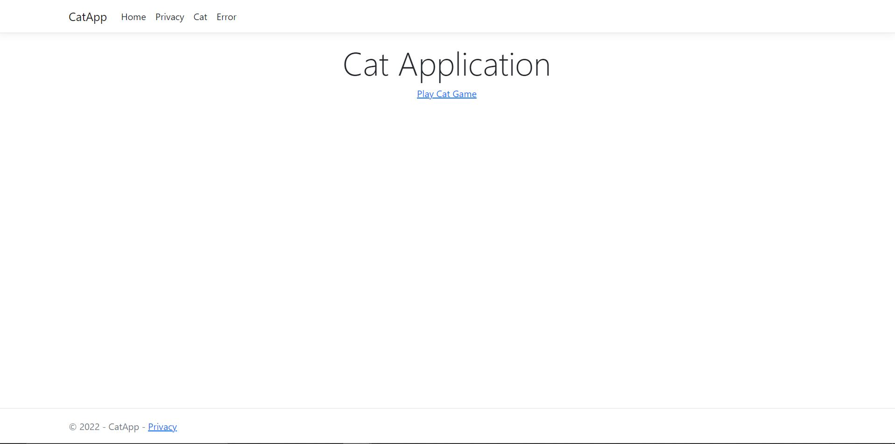
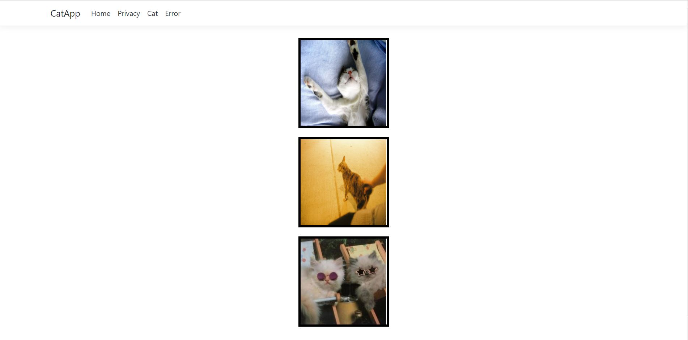

# Cat App

The cat app leverages the Cat API that can be found [here](https://thecatapi.com/).

Using environment variables, the cat app retrieves 10 cat images from the cat API by default.

Using environment variables, 3 of the 10 cat images are chosen at random by default.

If all 3 images are the same then the user wins, if not they lose.

Cat Application’s home page

Cat Application’s Game page

# Improvements

- App currently uses environment variables for the number of cat images to retrieve and how many random images to draw. A better solution could be getting the users to provide these values.
- The frontend is barebone a touch of bootstrap could have helped
- No testing was completed. xUnit plus Fluent Assertion are the preferred testing combination. This will enable the GetCats service and controller action to be tested.